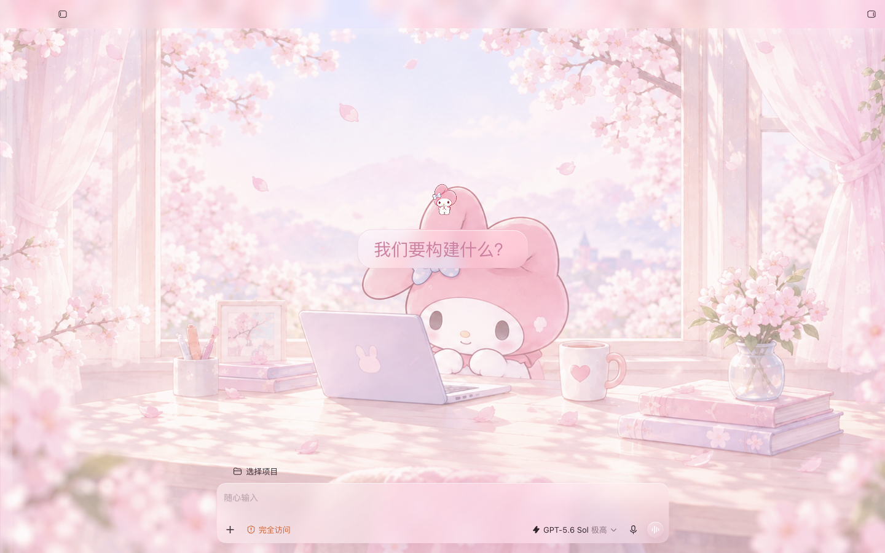
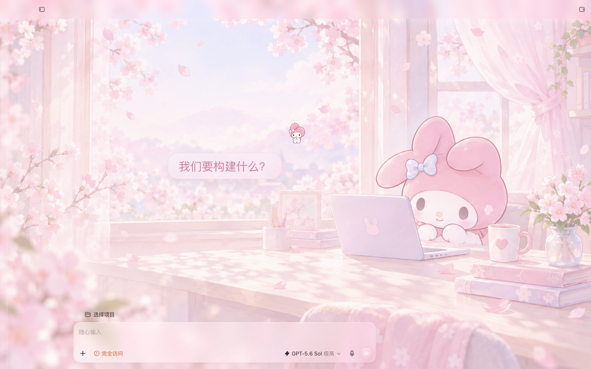

# Codex × My Melody · Sakura Desk

一个面向 macOS Codex 的本地主题与配套桌宠包。

本项目提供樱花书桌场景、两种背景构图和一套可在 Codex 中选择的桌宠。安装后可以按自己的窗口习惯选择主体居中或主体偏右的画面。

## 效果预览

下面是干净 Codex 窗口中的实际效果：

<table>
  <tr>
    <td width="50%" align="center">
      
      <br /><strong>主体居中构图</strong>
    </td>
    <td width="50%" align="center">
      
      <br /><strong>标准构图 · 主体偏右</strong>
    </td>
  </tr>
</table>

配套桌宠安装后，在 Codex **Settings → Appearance → Pets** 点 Refresh，选择 `My Melody · Codex`，再打开 **显示虚拟宠物**。

## 一键安装

在 macOS 终端执行：

```bash
INSTALL_DIR="${CODEX_MELODY_DIR:-${CODEX_HOME:-$HOME/.codex}/themes/codex-melody-skin}" \
&& git clone https://github.com/luu175ktovtsvor-spec/codex-melody-skin.git "$INSTALL_DIR" \
&& cd "$INSTALL_DIR" \
&& npm run setup
```

这条命令会完成主题构建、校验和桌宠安装，不会自动关闭或修改正在运行的 Codex。

需要 Git 和 Node.js 22+；项目没有第三方运行时依赖，不需要单独执行 `npm install`。

## 选择构图启动

先正常退出 Codex（`⌘Q`），再在仓库目录执行：

```bash
# 默认：标准构图，主体偏右
npm run launch

# 显式选择标准构图，主体偏右
npm run launch:right

# 选择主体居中
npm run launch:centered
```

也可以使用通用写法：

```bash
npm run launch -- --background right
npm run launch -- --background centered
```

启动时会按所选构图生成对应主题。按 `Ctrl-C` 会停止这次启动的 Codex 和主题监听。

## 两张背景图

- `theme/melody-background-standard-right.png`：标准构图，主体稍微偏右，给输入区和左侧内容留出空间。
- `theme/melody-background-subject-centered.png`：主体居中，适合希望角色位于视觉中心的窗口布局。

默认使用标准构图·主体偏右图。启动命令会根据 `centered` 或 `right` 自动选择对应文件；不需要手动改配置。

## 外观设置和卸载

主题使用浅色 chrome。应用前会保存原来的 `appearanceTheme`，需要时可以恢复：

```bash
npm run appearance -- --apply
npm run appearance -- --restore
```

覆盖已有同名桌宠包：

```bash
npm run install-pet -- --force
```

卸载桌宠：

```bash
npm run uninstall-pet -- --yes
```

## 仓库内容

- `theme/`：主题配置、样式和两张背景图。
- `pet/`：配套桌宠、首页图标和动画图集。
- `scripts/`：构建、启动、安装、恢复和校验命令。
- `docs/`：公开效果截图和本地预览页。

修改主题样式、配置或图片后，运行：

```bash
npm test
```

## 许可

原始代码和文档按 [MIT License](LICENSE) 发布。项目名称和界面兼容性不代表 Codex 或 OpenAI 官方发布或背书。
